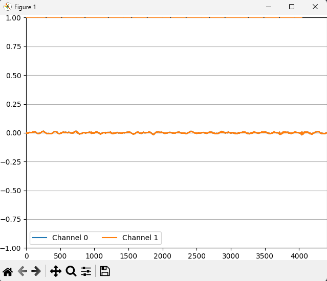
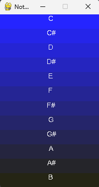

<p align="center">
    
    
</p>

# NoteRecognizer

Note recognition from microphone.

# Project structure

```py
src/ # The source code
```

## Getting Started

### Prerequisites

* Python 3.X

## Contributing

Ways to contribute:

* Check for open issues
* Read the ```TODO``` file

### Steps

1. Fork this repository
2. Create a new branch (optional)
3. Clone it
4. Make your changes
5. Upload them
6. Make a pull request here

## Authors

* **[Martin Kondor](https://github.com/MartinKondor)**

<p align="center"><a href="https://www.patreon.com/bePatron?u=17006186" data-patreon-widget-type="become-patron-button"></a></p>

## License

Copyright &copy; Martin Kondor 2019 - 2020

This repository is licensed under the ```BSD 3-Clause``` license.
See the [LICENSE](./LICENSE) file for more details.
